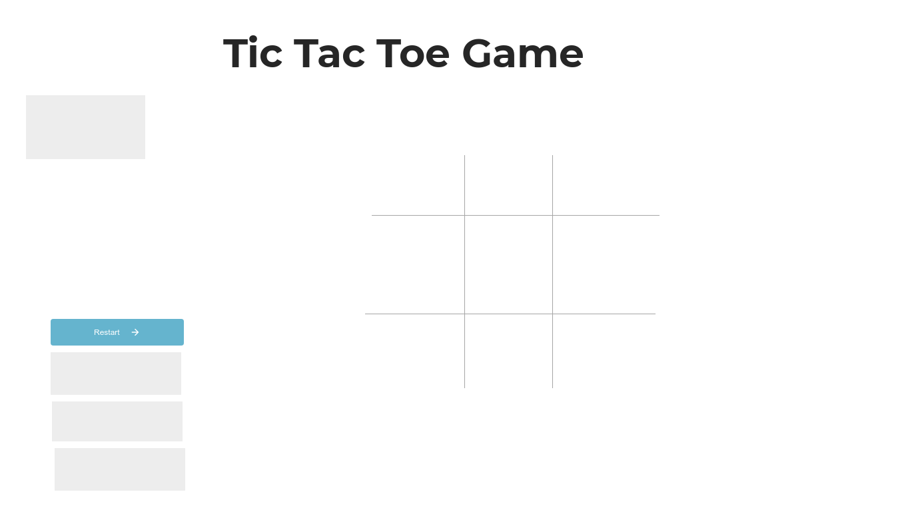

# Project #1: Tic Tac Toe
## Description :
Tic tac toe Game is game in which one player Represent Xs and another Represent Os and they play alternevly Using the board  .The winner will be who build 3 point vertically , horiztanlly and diognally. 

## planning Steps:

- Starting Strucure of the game board Using html and Styling using CSS.
- Starting of the user Stories To build Javascript code scenario .


### Description for the Winner 
- if condition that check After each click on the board if vertical ,Horiztanlly or Daiognal has the same Symbol So the Player Wins and Reinintialize it .


  

### User Stories

- As a user, I should be able to start a new tic tac toe game
- As a user, I should be able to click on a square to add X first and then O, and so on
- As a user, I should be shown a message after each turn for if I win, lose, tie or who's turn it is next
- As a user, I should not be able to click the same square twice
- As a user, I should be shown a message when I win, lose or tie
- As a user, I should not be able to continue playing once I win, lose, or tie
- As a user, I should be able to play the game again without refreshing the page

### Technologies used

- Html .
- CSS.
- javascripts Languege Using Visual Studio Code .
  

### Restart function 


 ```
   $('#Restart').on('click', function() {
    Messege.text("o's Turn");
    XScore.text('X Wins  :' + Xcount);
    OScore.text('O Wins  :  ' + OCount);
    TieScore.text('Tie   :    ' + TieCount);
    remove();
})
 ```

